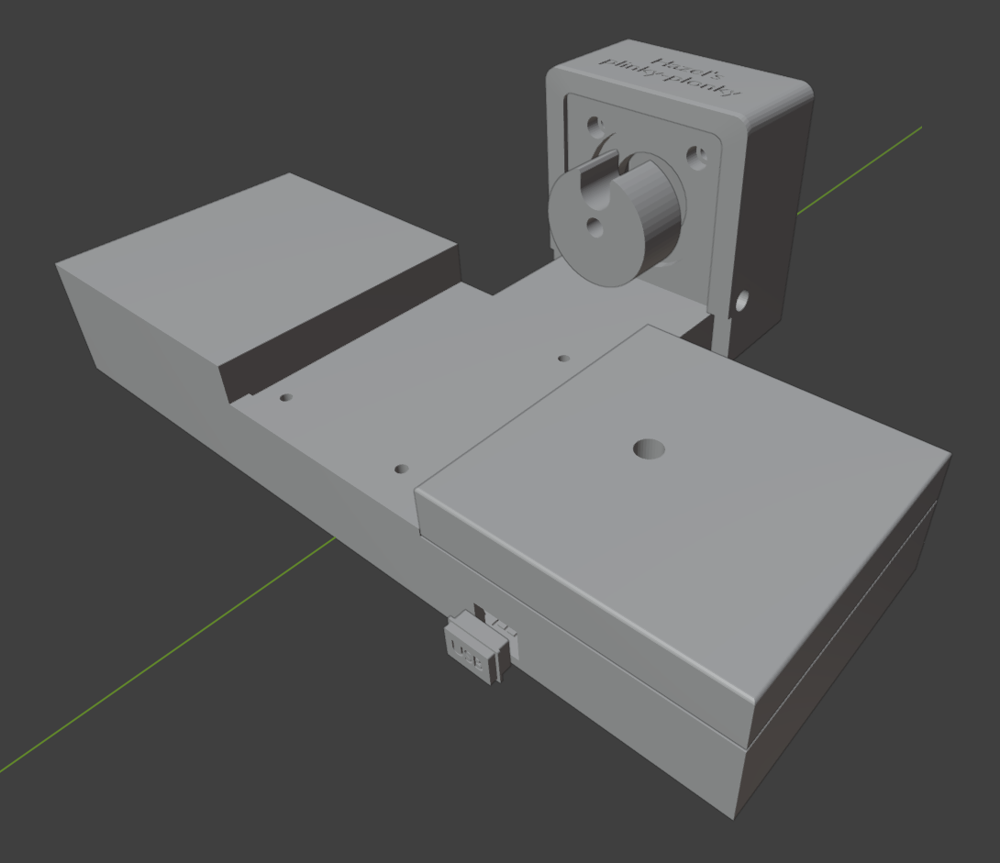
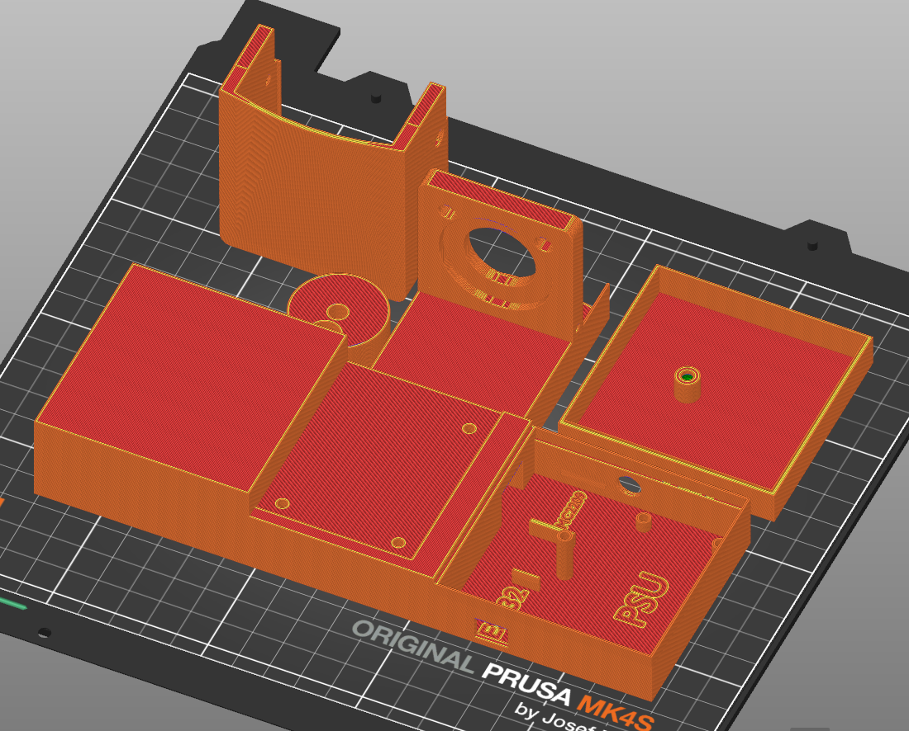
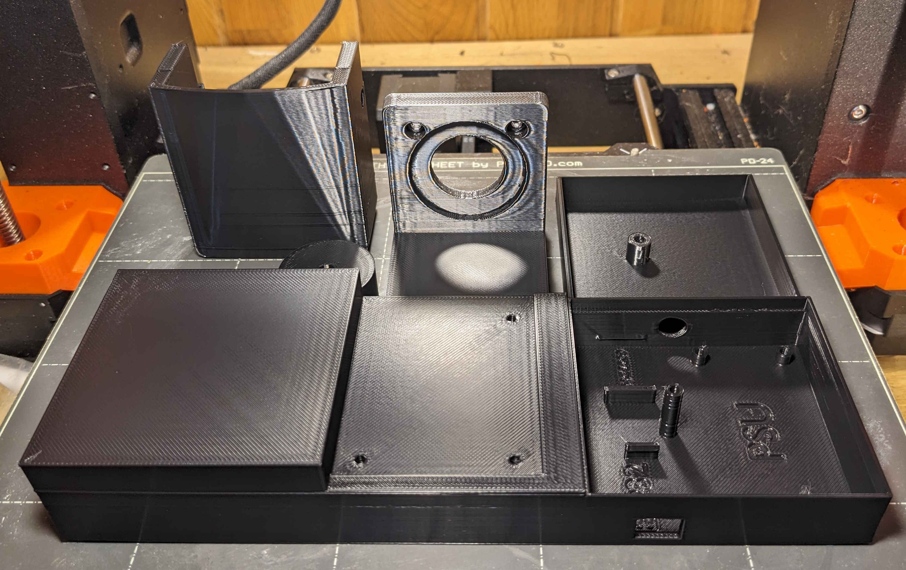

# Introduction
This folder contains the 3D printed parts.  I printed all of the parts in ASA for longevity but any material will do.

# Printing Instructions
All parts should be printed at fastest speed, 15% in-fill.  No supports should be required aside from the lid which will need supports on the build plate for the screw hole.

 